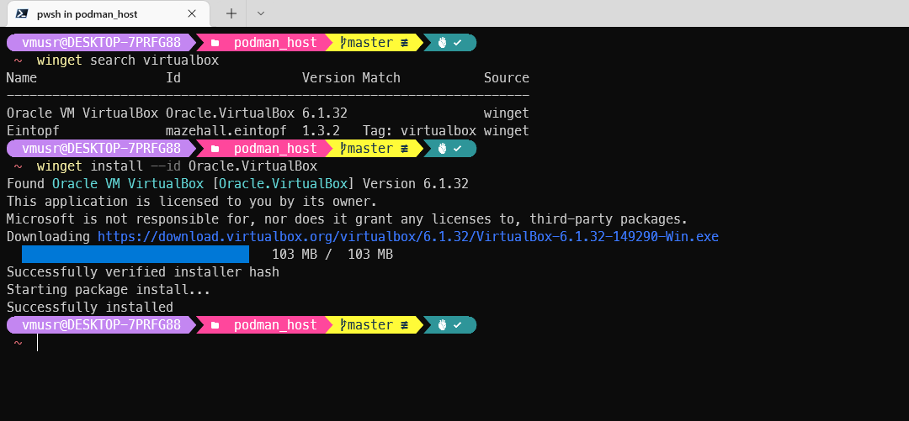
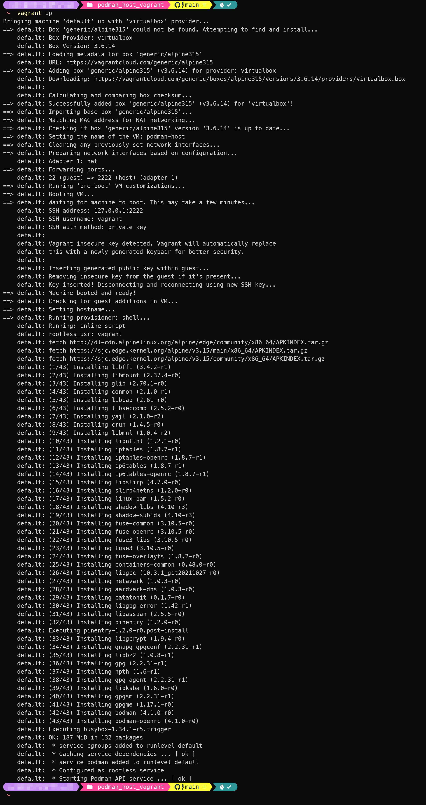
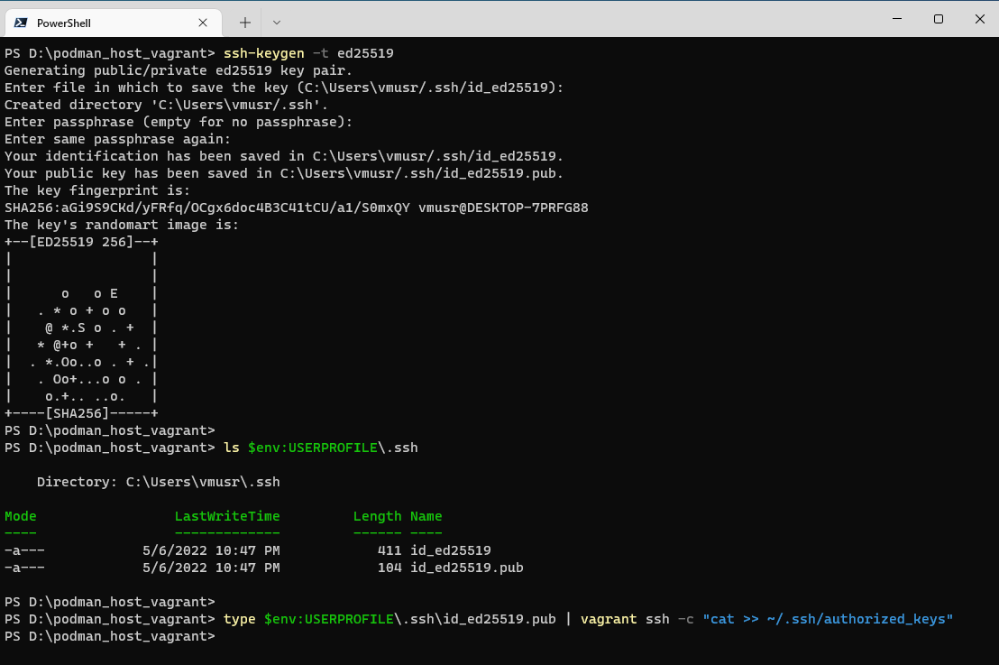
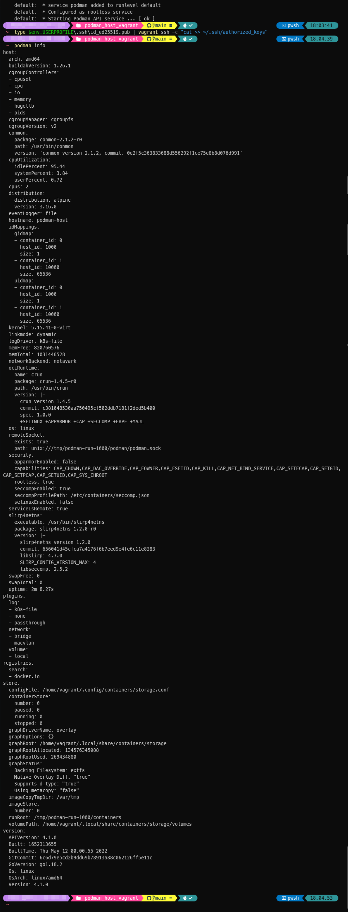
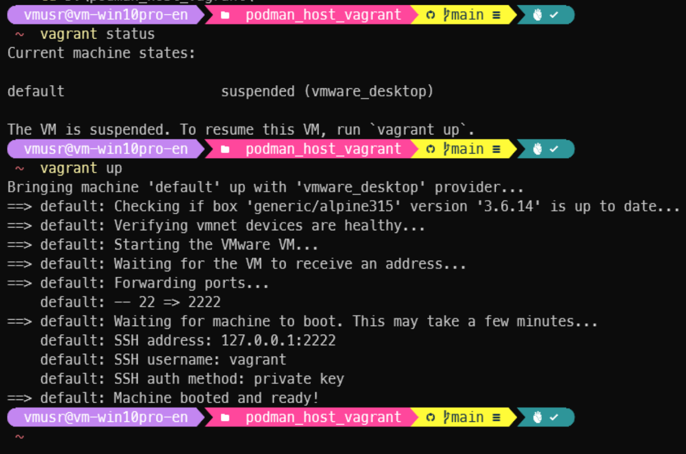

# Podman remote container host setup for Windows

## Prerequisites:

* [PowerShell v7.2 or above](https://docs.microsoft.com/en-us/powershell/scripting/install/installing-powershell-on-windows)
* [Vagrant](https://www.vagrantup.com/downloads) on Windows
* [VirtualBox](https://www.virtualbox.org/wiki/Downloads) or [VMware Workstation Pro](https://www.vmware.com/products/workstation-pro.html) / [VMWare Workstation Player](https://www.vmware.com/products/workstation-player.html) with [Vagrant vmware Utility](https://www.vagrantup.com/vmware/downloads) installed.
* [Podman Windows Client](https://podman.io/getting-started/installation#windows)


Vagrant, VirtualBox, VMWare Workstation Pro/Player, and Podman Windows Client can be installed from [**winget** (Windows Package Manager Client)](https://docs.microsoft.com/en-us/windows/package-manager/winget/) command line tool on Windows 10 & 11.

```powershell
winget install --id Hashicorp.Vagrant
```


```powershell
winget install --id Oracle.VirtualBox
```


```powershell
winget install --id RedHat.Podman
```


### Notes:

1. You need to re-open command line window to be able to use Podman cli program
2. You may need to reboot the computer for VirtualBox virtual network driver to take effect.

## Setup:

1. Git clone the [main branch of the repository](https://github.com/windperson/podman_host_vagrant/tree/main).
2. Inside the git clone folder, run ```vagrant up``` to create the Vagrant environment in PowerShell:
    
3. Generate an [ed25519](https://www.unixtutorial.org/how-to-generate-ed25519-ssh-key) SSH keypair files on Windows host, if you've never created before:
    ```powershell
    ssh-keygen -t ed25519
    ```
4. Copy the generated public key into the Vagrant Virtual Machine by following command in PowerShell:
    ```powershell
    type $env:USERPROFILE\.ssh\id_ed25519.pub | vagrant ssh -c "cat >> ~/.ssh/authorized_keys"
    ```  
    
5. Run ```vagrant ssh-config``` to get the SSH host binding port of the Vagrant VM:
    
6. Run following command to get the remote socket path information of Podman in the Vagrant VM:
    
    ```powershell
    vagrant ssh -c 'podman --remote info --format={{".Host.RemoteSocket.Path"}}'
    ```
    
      
    The above example shows the socket path is */tmp/podman-run-1000/podman/podman.sock*.
7. Run following command to add a remote VM connection settings on Host Windows machine, this example is using Port **2222**, remote socket path is **/tmp/podman-run-1000/podman/podman.sock**, and the connection name is **vg_podman**:
    
    ```powershell
    podman --remote system connection add vg_podman --identity $env:USERPROFILE\.ssh\id_ed25519 ssh://vagrant@127.0.0.1:2222/tmp/podman-run-1000/podman/podman.sock
    ```  
    Then use ```podman system connection list``` to verify the connection setting.  
    

## Notes

1. After finish above steps, you can use ```podman info``` on Windows to verify remote container host connection status.
    
2. If you need to recreate the VM, Invoke ```vagrant destroy -f``` in the git clone folder, then ```vagrant up``` again. Only needs do above step **4.** to copy the ed25519 public key from Windows into new VM.
3. The VM will automatically suspend when Windows system shutdown or reboot, it's state can be known via invoke ```vagrant status``` in the git clone folder, you need to resume the VM by running ```vagrant up``` to be able to use Podman host again.
    

