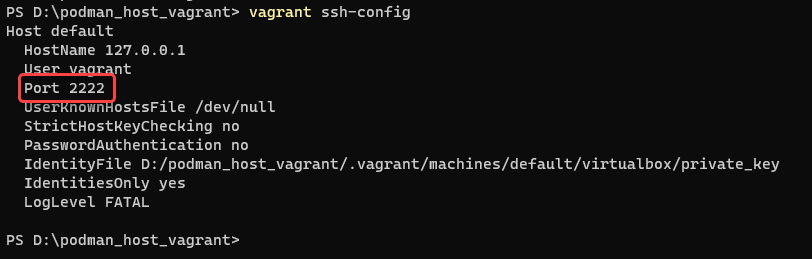
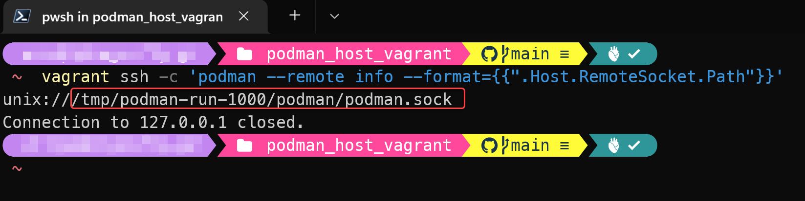
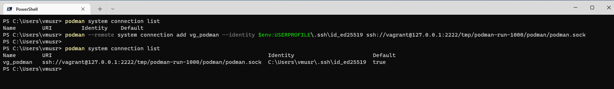
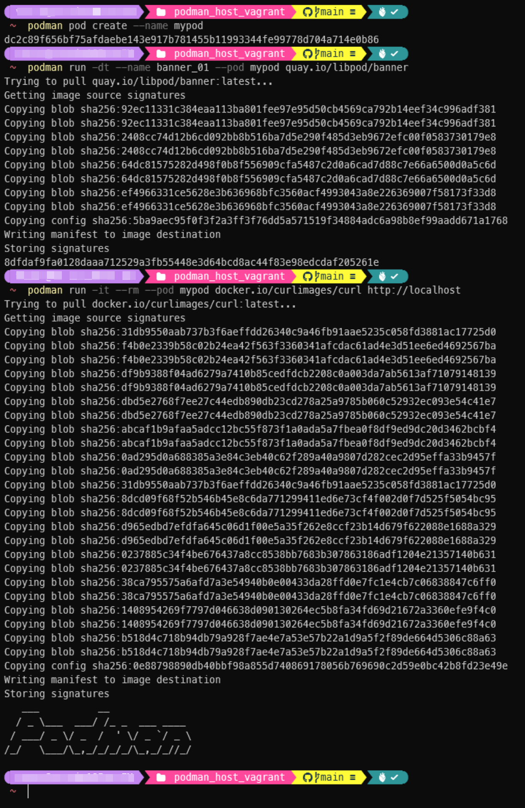

# Podman remote container host setup via Vagrant VirtualBox

## Prerequisites:

* [PowerShell v7.2 or above](https://docs.microsoft.com/en-us/powershell/scripting/install/installing-powershell-on-windows)
* [Vagrant](https://www.vagrantup.com/downloads) on Windows
* [VirtualBox](https://www.virtualbox.org/wiki/Downloads)
* [Podman Windows Client](https://podman.io/getting-started/installation#windows)


Vagrant, VirtualBox, and Podman Windows Client can be installed from [**winget** (Windows Package Manager Client)](https://docs.microsoft.com/en-us/windows/package-manager/winget/) command line tool on Windows 10 & 11.

```powershell
winget install --id Hashicorp.Vagrant
```


```powershell
winget install --id Oracle.VirtualBox
```


```powershell
winget install --id RedHat.Podman
```


**Notes:**

1. You need to re-open command line window to be able to use Podman cli program
2. You may need to reboot the computer for VirtualBox virtual network driver to take effect.

## Setup:

1. Git clone the [main branch of the repository](https://github.com/windperson/podman_host_vagrant/tree/main).
2. Inside the git clone folder, run ```vagrant up``` to create the Vagrant environment in PowerShell, during vagrant up execution, you may see the following message:
      
    Be sure to click the "Yes" button to grant the elevated privileges, the whole execution messages will be displayed like following:
    
3. Generate an [ed25519](https://www.unixtutorial.org/how-to-generate-ed25519-ssh-key) SSH keypair files on Windows host, if you've never created before:
    ```powershell
    ssh-keygen -t ed25519
    ```
4. Copy the generated public key into the Vagrant Virtual Machine by following command in PowerShell:
    ```powershell
    type $env:USERPROFILE\.ssh\id_ed25519.pub | vagrant ssh -c "cat >> ~/.ssh/authorized_keys"
    ```  
    
5. Run ```vagrant ssh-config``` to get the SSH host binding port of the Vagrant VM:
    
6. Run following command to get the remote socket path information of Podman in the Vagrant VM:
    
    ```powershell
    vagrant ssh -c 'podman --remote info --format={{".Host.RemoteSocket.Path"}}'
    ```
    
      
    The above example shows the socket path is */tmp/podman-run-1000/podman/podman.sock*.
7. Run following command to add a remote VM connection settings on Host Windows machine, this example is using Port **2222**, remote socket path is **/tmp/podman-run-1000/podman/podman.sock**, and the connection name is **vg_podman**:
    ```powershell
    podman --remote system connection add vg_podman --identity $env:USERPROFILE\.ssh\id_ed25519 ssh://vagrant@127.0.0.1:2222/tmp/podman-run-1000/podman/podman.sock
    ```  
    Then use ```podman system connection list``` to verify the connection setting.  
    

## Additional notes

1. After finish above steps, you can use ```podman info``` on Windows to verify remote container host connection status.
    
    Also you can run following commands to verify podman is functional, able to pull images from both **Redhat Quay**([quay.io](https://quay.io)) & **Docker Hub**([https://hub.docker.com](https://hub.docker.com)) registry and able to create rootless containers and communicates in pod:
    ```powershell
    podman pod create --name mypod
    podman run -dt --name banner_01 --pod mypod quay.io/libpod/banner
    podman run -it --rm --pod mypod docker.io/curlimages/curl http://localhost
    ```  
    
2. If you need to recreate the VM, Invoke ```vagrant destroy -f``` in the git clone folder, then ```vagrant up``` again. Only needs do above step **4.** to copy the ed25519 public key from Windows into new VM.
3. The VM will automatically suspend when Windows system shutdown or reboot, it's state can be known via invoke ```vagrant status``` in the git clone folder, you need to resume the VM by running ```vagrant up``` to be able to use Podman host again.
    
4. The podman daemon inside VM is using the ["rootless" mode](https://rootlesscontaine.rs/) , which means it cannot binding to port less than 1024 when invoke ```podman run``` command.
5. Due to the limitation of the NAT virtual network card of VirtualBox, if you want to access the running containers that has custom binding port, you need to reach it by 2nd network card of VM, which is Host-Only mode and the IP address can be found by following command:
    ```powershell
    vagrant ssh -c 'ip addr show eth1'
    ```
    
6. If your Windows Host enable the [Hyper-V](https://docs.microsoft.com/en-us/virtualization/hyper-v-on-windows/about/) or [WSL 2](https://docs.microsoft.com/en-us/windows/wsl/about#what-is-wsl-2) afterward, due to the underlying Hypervisor changed in Windows OS, you may experience the following error when ```vagrant up``` an already provisioned VM:
    
    You need to recreate the VM that described in notes **2**.
    
