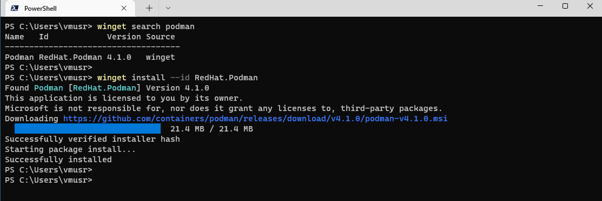

# Podman remote host VM for Windows

## Prerequisites:

* [Vagrant](https://www.vagrantup.com/downloads) on Windows
* [VirtualBox](https://www.virtualbox.org/wiki/Downloads) or [VMware Workstation Pro](https://www.vmware.com/products/workstation-pro.html) with [Vagrant vmware Utility](https://www.vagrantup.com/vmware/downloads) installed.
* [Podman Windows Client](https://podman.io/getting-started/installation#windows)

Vagrant, VirtualBox, and Podman Windows Client can be installed from [**winget** (Windows Package Manager Client)](https://docs.microsoft.com/en-us/windows/package-manager/winget/) command line tool on Windows 10 & 11.
